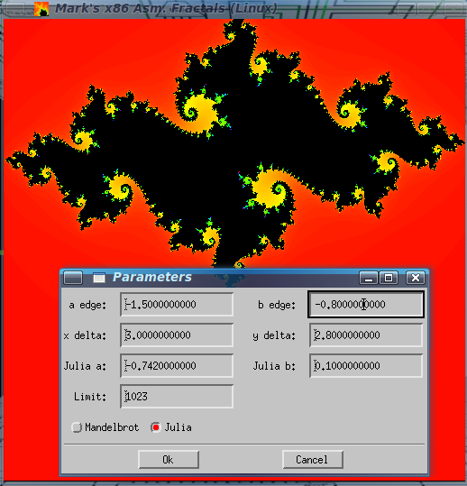

x86 Assembly Mandelbrot and Julia Fractal Program (Linux/Motif GUI)
==================================================================

<table>
<tr><td></td><td></td></tr>
<tr><td></td><td></td></tr>
</table>
 
## Introduction

This is a Mandelbrot and Julia Set fractal program written in x86 assembly
language and C.  I chose this mix because I didn't want to code the Linux
GUI stuff in assembly.  This program is based on the fractal program I wrote
for a CPU / computer design I created.  I have included that original program
in case you want to see how this project has evolved.  I created the x86 version
in order to learn x86 assembly language and in order to create a tutorial video
on x86 assembly language.  Because of this, I purposely only used basic x86
assembly.  That means no SSE, SSE2, AVX-512, etc.  Using newer x86 instructions
(vector, etc.) would make it faster, but would make it a bit harder to
understand and would deviate quite a bit from my original program (for my CPU
design).  For example, fmul versus VPCLMULQDQ to multiply.  Besides, GPU would
be faster anyway, in which case you wouldn't even use assembly.

This is not meant to be the best, most versatile, fractal program.  It was
meant to show assembly language programming.  BTW, this is why it's 512x512
resolution (with a 256x256 mode) - the original program was 256x256 due to the
resolution of Logisim's video screen component.  (Logisim is the simulation
program I used to simulate my CPU design - refer to my various videos to see
what I mean).

## Running

Start from either command line or icon.
*Once started, press 'h' to see the various keyboard controls.*  Or press
'0' through '9', '-', or 'a' to go to preset areas of the fractals.  To zoom,
press either 'z' for zoom by opposing corners or 'x' for zoom by center to
corner.  Then click (and hold) left mouse button to select first point and
drag to second point (and release).  Press 'u' to undo the zoom.  Zoom by
default preserves the square aspect ratio.  If that is not desired, press 'k'
to toggle that feature off/on.  Press 'p' to set or view the fractal
parameters.  BTW, to get images like the ones in my videos, lower the
(iteration) limit to 255.  Also, press 's' to save the current image to a
PPM file.

Most of the keyboard controls can be put on the command-line as if you pressed
them while the program is running.  For example:

    fractald 3-cd...

would choose Mandelbrot location #3 (3) to be displayed, then Mandelbrot
location #4 (-), then color cycling enabled (c), then cycling direction
changed (d), then cycling delta increased three times (.)

## Building

Linux executables are provided, so there shouldn't be a need to build, but if
you need to...

nasm is required to assemble the assembly code.  You can get it
[here](https://github.com/netwide-assembler/nasm).  It's official website is
[here](https://www.nasm.us).  You'll also need the X11 development files
installed (including libxpm-dev package if you want the program to have an
icon).  If you don't have the required packages, you can run this (you may
remove from this command any packages you already have installed or don't
want):

    sudo apt-get install libx11-dev libmotif-dev libxpm-dev nasm libsdl2-dev

Once you have the required tools, just:

    make

for the 32-bit version, or:

    make -f Makefile.64

for the 64-bit version.

These will make both the double and float versions of the fractal program.

While compiling, if you get an error message saying "... recompile with -fPIE",
uncomment the *NOPIE = -no-pie* line in the Makefile.64 file.  This might be
necessary due to changes in newer versions of gcc.

## Special Linux Version Notes

I had wanted to make this program as simple as possible, so at first, I didn't
use various toolkits such as GTK, Qt, Xt, Xaw, Motif, OLIT, XView, GLUT,
wxWidgets, SDL, Tk, etc.  But, I decided to make a Motif GUI version.  Motif
isn't the best, but I chose it because it had everything I needed and I could
also force it to work with my existing code rather than take over my existing
code.  I used Motif in probably an unorthodox way, but it works.  However,
there still is the ability to use SDL2 for the help message box, if that's
desired.  Use -DHAVE_SDL2 in CFLAGS and -lSDL2 in LFLAGS in makefiles
to compile in this feature.

Refer to the master branch for the non-Motif version.

Also, I chose not to use inline assembly, because in my opinion gcc's inline
assembly style is horrendous (despite what others say).  I kinda understand
why it has to be horrendous, but I don't like it.

## Link to Windows Version

[https://github.com/mrmcsoftware/FractalAsm](https://github.com/mrmcsoftware/FractalAsm)

## Manifest

<table>
<tr><td>fractald.c</td><td>"double" version of x86 fractal program - higher precision, but most likely slower</td></tr>
<tr><td>fractalf.c</td><td>"float" version of x86 fractal program</td></tr>
<tr><td>routinesd.asm</td><td>"double" assembly language routines</td></tr>
<tr><td>routinesf.asm</td><td>"float" assembly language routines</td></tr>
<tr><td>myicon.xpm</td><td>XPM image file representing the icon</td></tr>
<tr><td>Makefile</td><td>Makefile for 32-bit version</td></tr>
<tr><td>Makefile.64</td><td>Makefile for 64-bit version</td></tr>
<tr><td>&nbsp;</td><td>&nbsp;</td></tr>
<tr><td>fractalb_not_x86.asm</td><td>My original fractal program for my CPU design</td></tr>
<tr><td>&nbsp;</td><td>&nbsp;</td></tr>
<tr><td>fractald</td><td>ELF 32-bit Linux executable (double version)</td></tr>
<tr><td>fractalf</td><td>ELF 32-bit Linux executable (float version)</td></tr>
<tr><td>fractald64</td><td>ELF 64-bit Linux executable (double version)</td></tr>
<tr><td>fractalf64</td><td>ELF 64-bit Linux executable (float version)</td></tr>
<tr><td>&nbsp;</td><td>&nbsp;</td></tr>
<tr><td>fractal*.png</td><td>Screenshots</td></tr>
<tr><td>README.md</td><td>This file</td></tr>
</table>

## Demonstration Videos

[My x86 assembly language tutorial video containing an earlier version of this fractal program for Windows (starting at 3:42)](https://www.youtube.com/watch?v=KgPVx_kfBik)

[Part 1 of that x86 assembly language tutorial](https://www.youtube.com/watch?v=2i935mP6hUM)

[My CPU / computer design running my original fractal program written for that design](https://www.youtube.com/watch?v=ygf0aa1r3NY)

## Author

Mark Craig
[https://www.youtube.com/MrMcSoftware](https://www.youtube.com/MrMcSoftware)
